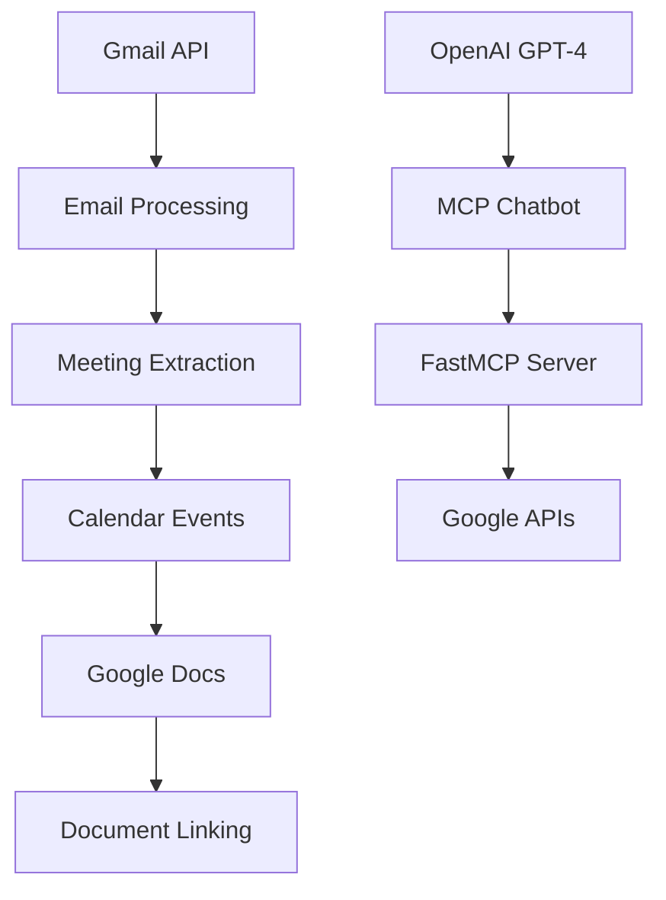
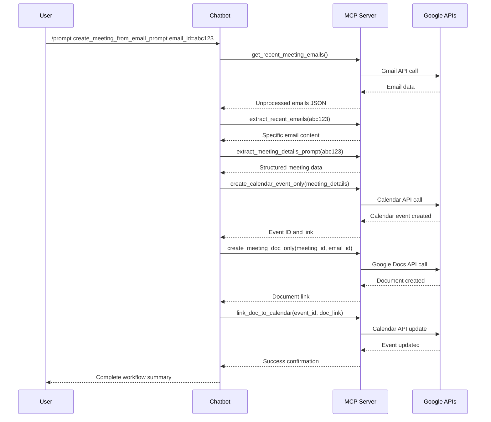

# Google Workspace MCP Server & Chatbot - Complete Documentation

## Project Overview

### Executive Summary
A comprehensive **Model Context Protocol (MCP)** server and chatbot system for automating Google Workspace operations, specifically designed for intelligent meeting management workflows from email processing.

### Key Value Proposition
- **Automated Meeting Creation**: Transform emails into complete meeting setups
- **AI-Driven Email Processing**: Extract meaningful meeting information automatically  
- **Integrated Workspace**: Seamlessly connect Gmail, Calendar, and Google Docs
- **Conversational Interface**: Natural language chatbot for workflow execution

---

## System Architecture

### Core Components

| Component | File | Purpose | Type |
|-----------|------|---------|------|
| **MCP Server** | `server.py` | Google Workspace integration backend | FastMCP Server |
| **Chatbot Client** | `mcp_chatbot.py` | Interactive user interface | OpenAI + MCP Client |
| **Configuration** | `src/config.py` | System constants and settings | Configuration Module |
| **Data Models** | `src/models.py` | Data structures and types | Data Layer |

### Technology Stack



### Dependencies
```toml
# Core MCP & AI
mcp[cli] >= 1.10.1
openai >= 1.93.1

# Google Workspace APIs  
google-api-python-client >= 2.175.0
google-auth-httplib2 >= 0.2.0
google-auth-oauthlib >= 1.2.2

# Data Processing
pandas >= 2.3.0
langchain >= 0.3.26
requests >= 2.32.4
```

---

## MCP Server Implementation (`server.py`)

### Resources (Data Access Layer)
The server exposes structured data through MCP resource URIs:

#### Gmail Resources
| URI | Description | Handler Function |
|-----|-------------|------------------|
| `gmail://meeting-emails` | Unprocessed meeting emails | `get_unprocessed_meetings()` |
| `gmail://processed-meetings` | Processed meeting data | `get_processed_meetings()` |  
| `gmail://meeting-emails/{id}` | Specific email details | `get_meeting_email(email_id)` |

#### Project Resources
| URI | Description | Handler Function |
|-----|-------------|------------------|
| `project://info` | Project information | `get_project_info()` |
| `project://feature-updates` | Feature updates | `get_feature_updates()` |
| `project://status` | Project status | `get_project_status()` |

#### Company Resources  
| URI | Description | Handler Function |
|-----|-------------|------------------|
| `company://info` | Company information | `get_company_info()` |
| `company://solution-info` | Solution information | `get_solution_info()` |
| `company://all-info` | Complete company data | `get_all_info()` |
| `company://docs` | Company documents | `get_company_docs()` |

### Tools (Action Layer)
Executable functions for Google Workspace operations:

#### Email Processing Tools
```python
@mcp.tool()
async def get_recent_emails_tool() -> str:
    """Get recent emails that appear to be about meetings"""
    
@mcp.tool() 
async def extract_recent_emails_tool(emailId: str) -> str:
    """Extract recent meeting-related emails from Gmail"""

@mcp.tool()
async def extract_email_details_tool(email_id: str) -> str:
    """Extract meeting details from email content"""
```

#### Calendar Management Tools
```python
@mcp.tool()
async def create_calendar_event_only_tool(
    email_id: str, start_time: str, duration_hours: int
) -> str:
    """Create calendar event from meeting details"""
    
@mcp.tool()
async def check_conflicting_meetings_tool(
    start_time: str, end_time: str, calendar_id: str
) -> str:
    """Check for conflicting meetings"""

@mcp.tool()
async def cancel_meeting_tool(meeting_id: str) -> str:
    """Cancel a meeting in the calendar"""

@mcp.tool()
async def reschedule_meeting_tool(
    meeting_id: str, new_start_time: str, new_end_time: str
) -> str:
    """Reschedule a meeting"""
```

#### Document Generation Tools
```python
@mcp.tool()
async def create_meeting_doc_only_tool(meeting_id: str, email_id: str) -> str:
    """Create meeting document from details"""
    
@mcp.tool()
async def link_doc_to_calendar_tool(event_id: str, doc_link: str) -> str:
    """Add document link to existing calendar event"""
```

#### Communication Tools
```python
@mcp.tool()
async def create_draft_email_and_send_tool(
    subject: str, body: str, to: str, cc: str, bcc: str
) -> dict:
    """Create and send email drafts"""
```

### Prompts (Workflow Orchestration Layer)
Pre-defined AI prompts for complex workflows:

#### Core Meeting Prompts
```python
@mcp.prompt()
async def extract_meeting_details_prompt_handler(email_id: str) -> str:
    """Extract meeting information from email text"""

@mcp.prompt() 
async def create_meeting_from_email_prompt_handler(
    email_id: str, calendar_id: str = "primary"
) -> str:
    """Guide for creating complete meeting workflow from email"""
```

#### Communication Workflow Prompts
```python
@mcp.prompt()
async def client_inquiry_prompt_handler(email_id: str) -> str:
    """Handle client inquiry workflows with email response"""
    
@mcp.prompt()
async def project_response_prompt_handler(email_id: str) -> str:
    """Handle project-related communications"""
    
@mcp.prompt()
async def internal_team_prompt_handler(email_id: str) -> str:
    """Handle internal team queries"""
```

---

## Chatbot Implementation (`mcp_chatbot.py`)

### Core Architecture
```python
class MCP_ChatBot:
    def __init__(self):
        self.exit_stack = AsyncExitStack()
        self.openai = OpenAI()
        self.available_tools = []
        self.available_prompts = []
        self.sessions = {}  # Maps tools/resources to MCP sessions
```

### Key Features

#### Multi-Server Connection Management
- Connects to multiple MCP servers simultaneously
- Maintains session mapping for tools, prompts, and resources
- Automatic server configuration loading from `server_config.json`

#### OpenAI Integration  
- GPT-4 model integration for natural language processing
- Automatic tool calling based on user queries
- Context-aware conversation handling

#### Command Interface System

**Resource Access Commands:**
```bash
# Gmail Resources
@meeting-emails                    # Get recent meeting emails
@processed-meetings               # Get processed meeting data  
@meeting-emails/<email_id>        # Get specific email details

# Project Resources  
@project-info                     # Get project information
@feature-updates                  # Get feature updates
@project-status                   # Get project status

# Company Resources
@company-info                     # Get company information
@solution-info                    # Get solution information  
@company-all-info                 # Get all company info
@company-docs                     # Get company documents
```

**System Commands:**
```bash
/resources                        # List all available resources
/prompts                          # List all available prompts
/prompt <name> <arg1=value1>      # Execute specific prompt
```

### Workflow Processing Engine
```python
async def process_query(self, query):
    """Main query processing with OpenAI integration"""
    # 1. Send query to GPT-4
    # 2. Process tool calls
    # 3. Execute MCP tools via sessions
    # 4. Return results to conversation
```

---

## Source Code Architecture (`src/` folder)

### Directory Structure
```
src/
├── __init__.py
├── config.py              # Configuration constants
├── models.py              # Data models  
├── workspace.py           # Workspace utilities
├── data/                  # Data storage
│   ├── gmail/            # Email data
│   ├── knowledge-repository/  # Company knowledge
│   └── project-repository/    # Project data
├── prompts/              # AI prompt templates
│   ├── client_inquiry_prompts.py
│   └── meeting_prompts.py
├── resources/            # MCP resource handlers
│   ├── company_resources.py
│   ├── meeting_resources.py
│   └── project_resources.py  
├── tools/                # MCP tool implementations
│   ├── client_info_tools.py
│   ├── gmail_tools.py
│   ├── meeting_tools.py
│   ├── project_info_tools.py
│   └── teams_tools.py
├── utils/                # Utility functions
│   └── intent_classifier.py
└── secrets/              # Credentials (gitignored)
    ├── credentials.json
    └── token.json
```

### Configuration Layer (`src/config.py`)
```python
# Google API Scopes
SCOPES = [
    "https://www.googleapis.com/auth/gmail.modify",
    "https://www.googleapis.com/auth/calendar", 
    "https://www.googleapis.com/auth/drive",
    "https://www.googleapis.com/auth/documents",
]

# File Paths
GMAIL_DIR = "src/data/gmail"
CREDENTIALS_FILE = "src/secrets/credentials.json" 
TOKEN_FILE = "src/secrets/token.json"

# Default Settings
DEFAULT_MEETING_TIME = "10:00 AM"
DEFAULT_MEETING_DURATION_HOURS = 1
```

### Data Models (`src/models.py`)
```python
@dataclass
class MeetingContext:
    """Store meeting context for document generation"""
    meeting_title: str
    attendees: List[str] 
    email_content: str
    meeting_purpose: str
    key_topics: List[str]
    action_items: List[str]
```

### Tool Implementations
The `src/tools/` directory contains specialized tool implementations:

#### Meeting Tools (`meeting_tools.py`)
- **Email Processing**: Extract and analyze meeting-related emails
- **Calendar Operations**: Create, update, cancel, reschedule meetings  
- **Document Management**: Generate meeting docs and link to calendar
- **Conflict Detection**: Check for scheduling conflicts

#### Gmail Tools (`gmail_tools.py`)  
- **Email Operations**: Draft creation, sending, and management
- **Thread Management**: Handle email conversations
- **Attachment Processing**: Handle file attachments

### Resource Handlers
The `src/resources/` directory provides data access layers:

#### Meeting Resources (`meeting_resources.py`)
```python
async def get_unprocessed_meetings() -> str:
    """Return JSON of unprocessed meeting emails"""
    
async def get_processed_meetings() -> str:
    """Return JSON of processed meeting data"""
    
async def get_meeting_email(email_id: str) -> str:
    """Get specific meeting email details"""
```

#### Company Resources (`company_resources.py`)
- Company information management
- Solution documentation access
- Internal document retrieval

#### Project Resources (`project_resources.py`)  
- Project status tracking
- Feature update information
- Development timeline access

---

## Complete Workflow Examples

### 1. Email-to-Meeting Creation Workflow

**User Query:**
```
/prompt create_meeting_from_email_prompt email_id=abc123
```

**Execution Pipeline:**


### 2. Natural Language Query Processing

**User Query:**
```
"Create a meeting from the project kickoff email and share it with the team"
```

**AI Processing Flow:**
1. **Intent Recognition**: Identify meeting creation intent
2. **Email Identification**: Find relevant project kickoff email
3. **Tool Selection**: Choose appropriate MCP tools
4. **Workflow Execution**: Execute multi-step process
5. **Result Synthesis**: Provide comprehensive summary

---

## Security & Authentication

### Google API Authentication
```python
# OAuth 2.0 Flow
SCOPES = [
    "https://www.googleapis.com/auth/gmail.modify",
    "https://www.googleapis.com/auth/calendar",
    "https://www.googleapis.com/auth/drive", 
    "https://www.googleapis.com/auth/documents",
]

# Credential Management
CREDENTIALS_FILE = "src/secrets/credentials.json"
TOKEN_FILE = "src/secrets/token.json"
```

### Access Control
- **Minimal Permissions**: Only required Google API scopes
- **Local Storage**: Credentials stored locally, not transmitted
- **Automatic Sharing**: Meeting docs shared only with identified attendees
- **Secure Sessions**: MCP sessions with proper authentication

---

## Installation & Setup

### Prerequisites
- Python 3.13+
- Google Workspace account with API access  
- OpenAI API key

### Step-by-Step Setup

1. **Clone and Install**
   ```bash
   git clone <repository>
   cd google-workspace
   pip install -e .
   ```

2. **Google API Configuration**
   ```bash
   # 1. Enable APIs in Google Cloud Console:
   #    - Gmail API, Calendar API, Drive API, Docs API
   # 2. Download credentials.json 
   # 3. Place in src/secrets/credentials.json
   ```

3. **Environment Setup**
   ```bash
   # Create .env file
   echo "OPENAI_API_KEY=your_api_key_here" > .env
   ```

4. **First Run Authentication**
   ```bash
   python server.py  # Complete OAuth flow
   ```

### Configuration Files

**`server_config.json`**
```json
{
  "mcpServers": {
    "google-workspace": {
      "command": "python",
      "args": ["server.py"]
    }
  }
}
```

---

## Usage Examples

### Basic Resource Access
```bash
# Start chatbot
python mcp_chatbot.py

# Get recent meeting emails
Query: @meeting-emails

# Get specific email details  
Query: @meeting-emails/abc123

# List available resources
Query: /resources
```

### Workflow Execution
```bash
# Execute meeting creation workflow
Query: /prompt create_meeting_from_email_prompt email_id=abc123

# Natural language processing
Query: "Schedule the quarterly review meeting for next week"

# Email processing
Query: "Extract meeting details from the latest project email"
```

### Advanced Operations
```bash
# Check for conflicts
Query: "Check if there are any conflicts for Friday 3 PM meeting"

# Reschedule meeting
Query: "Move the project meeting to next Monday at 2 PM"

# Generate meeting summary
Query: "Create a summary document for the completed project kickoff"
```

---

## Development & Extension

### Adding New Tools
```python
@mcp.tool()
async def custom_meeting_tool(param: str) -> str:
    """Custom tool description"""
    # Implementation
    return result
```

### Adding New Resources
```python  
@mcp.resource("custom://resource-name")
async def custom_resource() -> str:
    """Custom resource description"""
    # Data retrieval logic
    return data
```

### Adding New Prompts
```python
@mcp.prompt()
async def custom_workflow_prompt(param: str) -> str:
    """Custom workflow orchestration"""
    # Workflow definition
    return prompt_text
```

---

## Performance & Monitoring

### Logging Configuration
```python
logging.basicConfig(
    level=logging.INFO,
    format="%(asctime)s %(levelname)s %(name)s %(message)s",
)
logger = logging.getLogger("GoogleWorkspaceMCP")
```

### Error Handling Patterns
- Comprehensive error logging throughout system
- Graceful fallbacks for missing email data  
- Automatic retry mechanisms for API failures
- User-friendly error messages in chatbot interface

### Performance Considerations
- **Async Operations**: All I/O operations are asynchronous
- **Session Management**: Efficient MCP session reuse
- **API Rate Limiting**: Respectful Google API usage
- **Memory Management**: Proper resource cleanup

---

## Future Enhancements

### Planned Features
- [ ] **Multi-timezone Support**: Better handling of global teams
- [ ] **Template Management**: Customizable meeting document templates
- [ ] **Integration Expansion**: Slack, Microsoft Teams support
- [ ] **Advanced Analytics**: Meeting effectiveness metrics
- [ ] **Mobile Interface**: Responsive web interface
- [ ] **Voice Commands**: Speech-to-text integration

### Technical Improvements  
- [ ] **Database Integration**: Persistent data storage
- [ ] **Webhook Support**: Real-time email processing
- [ ] **Batch Operations**: Bulk meeting processing
- [ ] **Custom Calendars**: Support for multiple calendar accounts
- [ ] **Enhanced Security**: Advanced access controls

---

## API Reference

### MCP Tools Quick Reference

| Tool Name | Parameters | Return Type | Description |
|-----------|------------|-------------|-------------|
| `get_recent_emails_tool` | None | `str` | Get meeting-related emails |
| `extract_email_details_tool` | `email_id: str` | `str` | Extract meeting details |  
| `create_calendar_event_only_tool` | `email_id: str, start_time: str, duration_hours: int` | `str` | Create calendar event |
| `create_meeting_doc_only_tool` | `meeting_id: str, email_id: str` | `str` | Create meeting document |
| `link_doc_to_calendar_tool` | `event_id: str, doc_link: str` | `str` | Link doc to calendar |

### MCP Resources Quick Reference

| Resource URI | Handler | Description |
|--------------|---------|-------------|
| `gmail://meeting-emails` | `get_unprocessed_meetings` | Unprocessed meeting emails |
| `gmail://processed-meetings` | `get_processed_meetings` | Processed meeting data |
| `project://info` | `get_project_info` | Project information |
| `company://info` | `get_company_info` | Company information |

---


